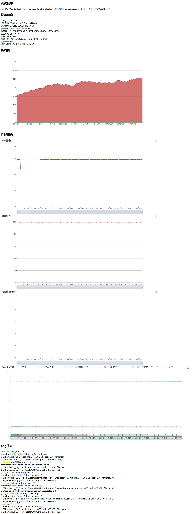

# 通用性能监控报表工具
## 工具初衷
项目性能问题是一个贯穿项目研发始终的问题，就像研发工程师每天在开发新的功能之后QA每天都会关注是否产生新的bug，同样只要写了新代码就会带来或多或少的新的性能问题，产生的性能问题的大小取决于团队每个开发人员的代码素养和开发能力，每个人都不想写性能差的代码，只是有时候我们无意识的就写出来了，所以就需要有一个性能监控工具来给研发人员或QA做代码自检或者日常的测试检测，这样才能及时发现每天产生的bug或者性能问题，只有日常把性能问题当成跟bug一样的做好检测，才能在最后上线的时候尽可能少的碰到性能问题而要花大量的时间去定位和处理。现在有性能监控工具里面有设置的警戒值，并不是一种标准值，而是一个默许的约束规范，只要超过预警值的函数，每个人自己先去尝试优化自己的代码，优化不是某一两个人的事情，让全员参与其中，只有每个人都尽可能输出高质量高性能的代码，团队的成果才更有可能聚沙成塔，最终形成是一个高性能的聚合产品。

## 问题现状
* 测试测性能报告不方便
（QA想要出一个现场走测的内存报告，需要一手拿电脑，一手拿手机，非常的不安全，大冬天也非常冷，走测完之后QA需要整理数据然后生成图表，时效性比较低，等报告时间久，然后需要转发给程序）

* 查看Log不方便
（QA反馈app的bug，然后技术需要知道测试环境，手机的配置信息，Log信息需要从手机中导出来然后发给技术排查问题，流程繁琐不便）

* 版本测试以及更新不及时
（不能及时监测性能问题，每个小版本，甚至每个小功能的版本性能状况对比，性能问题是我们河图团队比较棘手的一个问题，也是我们忽略的问题，如果做To C产品，玩家对性能问题是非常苛刻的，容忍性非常低，所以必须要重视版本性能问题）

* 开发人员在每日开发提交前只会自测bug
我们开发人员在提交之前可以做到自测自己写的代码流程上是否跑的通，自己的开发模块是否有明显的bug，但不会去关注自己的写的代码是否有严重的性能问题，在没有专门的工具检测之前，写的代码是否优劣也是取决于程序员各自的水平和素养，但有了专门性能检测的工具，我们就通过工具来检测我们写的每一个函数代码它的执行效率和内存开辟的情况，如果问题严重的话就要做到自我优化代码

## 本工具优点
* 查看报告非常方便（测完能够立马出报告，而且手机端PC端只要浏览器就可以打开查看此次测试报告）
* 查看项目中每个函数的调用次数，内存申请开辟情况(是否有严重的内存泄漏)，函数的执行时间(会影响app的运行帧率)
* 能查看历史报告好做对比，报告每次都会存档
* 对接非常容易，通用SDK方案
* 报告生成我们关注的信息和技术指标
	* 应用和测试信息
		* 应用名
		* 包名
		* 测试系统
		* 版本号
		* 本次测试时长

	* 设备详细信息
		* Unity版本号
		* 设备系统
		* 设备模型
		* 设备名称
		* 设备ID
		* 系统内存
		* 系统显存
		* 设备支持的最新渲染接口版本
		* 设备电量
		* 设备分辨率

	* 性能指标报表
		* 帧率
		* 电量（功耗）
		* 内存使用
        * 托管堆内存大小
        * 堆内存使用大小
        * Unity分配的内存
        * Unity保留的总内存
        * 未使用的内存

	* 详细Log信息并猜测标注Log级别
		* Error（红色）
		* Warning（黄色）
		* Log（蓝色）

* 添加是否显示Log显示可选项
由于Log显示会影响帧率，如果不需要查看Log就可以关闭Log选项，那报告就不会显示Log模块报告，也不会搜集Log，如果是开发阶段定位问题可以打开Log模块的追踪

## 效果
http://124.223.54.98/report_2022_1_21_14_33_30.html

## feature
* 生成每一帧的截图，能够定位哪一帧卡顿当时的渲染情况
* 生成堆栈调用信息，方便深度定位问题
* 适配Lua性能监测
* 内存泄漏定位
* 生成版本对比报告(Word)指出性能问题汇总以及优化建议
* 支持代码规范新检测
* 支持overdraw帧图显示

## 工程仓库
https://codehub-g.huawei.com/d00605132/MonitorTool/home

## 备注
如果还需要支持其他性能报表，欢迎讨论添加