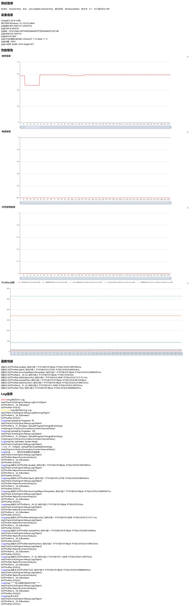

# Unity监控报表工具

## 工具初衷
项目性能问题是一个贯穿项目研发始终的问题，就像研发工程师每天在开发新的功能之后QA每天都会关注是否产生新的bug，同样只要写了新代码就会带来或多或少的新的性能问题，产生的性能问题的大小取决于团队每个开发人员的代码素养和开发能力，每个人都不想写性能差的代码，只是有时候我们无意识的就写出来了，所以就需要有一个性能监控工具来给研发人员或QA做代码自检或者日常的测试检测，这样才能及时发现每天产生的bug或者性能问题，只有日常把性能问题当成跟bug一样的做好检测，才能在最后上线的时候尽可能少的碰到性能问题而要花大量的时间去定位和处理。现在有性能监控工具里面有设置的警戒值，并不是一种标准值，而是一个默许的约束规范，只要超过预警值的函数，每个人自己先去尝试优化自己的代码，优化不是某一两个人的事情，让全员参与其中，只有每个人都尽可能输出高质量高性能的代码，团队的成果才更有可能聚沙成塔，最终形成是一个高性能的聚合产品。

## 问题现状
* 测试测性能报告不方便
（QA想要出一个现场走测的内存报告，需要一手拿电脑，一手拿手机，非常的不安全，大冬天也非常冷，走测完之后QA需要整理数据然后生成图表，时效性比较低，等报告时间久，然后需要转发给程序,非常的麻烦）目前工具优化之后的流程是，QA在场外走测，只需要点击一下UI上的监控按钮，走测结束后再点击一下按钮结束监控流程，UI上弹出报告URL可以手机上及时查看，同时想关注报告的相关人员同事就会收到此次报告的邮件通知，让相关人员能及时查看到测试报告，开发跟测试同事之间根本不需要转发和通知报告，非常的方便

* 查看Log不方便
（QA反馈app的bug，然后技术需要知道测试环境，手机的配置信息，Log信息需要从手机中导出来然后发给技术排查问题，流程繁琐不便）目前工具做到的优化流程是，由于输入log会影响帧率，所以在转测包的时候有可选项是否报告中要显示Log，如果点击了显示Log则不需要太过关注帧率的折线图报告，这是不准的，如果不需要看Log，只看商用测试包，则可以取消勾选Log监控，这时候web报告就不会产出Log，此时的帧率就是准确的帧率。

* 版本测试以及更新不及时
（不能及时监测性能问题，每个小版本，甚至每个小功能的版本性能状况对比，性能问题是我们河图团队比较棘手的一个问题，也是我们忽略的问题，如果做To C产品，玩家对性能问题是非常苛刻的，容忍性非常低，所以必须要重视版本性能问题）

* 开发人员在每日开发提交前只会自测bug
(我们开发人员在提交之前可以做到自测自己写的代码流程上是否跑的通，自己的开发模块是否有明显的bug，但不会去关注自己的写的代码是否有严重的性能问题，在没有专门的工具检测之前，写的代码是否优劣也是取决于程序员各自的水平和素养，但有了专门性能检测的工具，我们就通过工具来检测我们写的每一个函数代码它的执行效率和内存开辟的情况，如果问题严重的话就要做到自我优化代码)工具做到的优化之后的流程是，研发人员在写完代码之后不仅可以自测有没有逻辑上的bug，也可以自测代码有没有性能问题，这里的建议是单个函数运行时间不要超过15毫秒和单个函数每帧持续开辟的内存最好不要超过2-3kb，当然指标可以适度调整，视情况和项目而定，在充分自测没问题之后再提交到主仓中，如果有性能问题自己没法解决可以求助相关同事，如果实在不好在优化的话可以向相关负责人说明一下再提交，这样确保主仓上每一笔提交代码尽量都没有严重的性能问题的代码

## 本工具优点
* 查看报告非常方便（测完能够立马出报告，而且手机端PC端只要浏览器就可以打开查看此次测试报告）
* 查看项目中每个函数的调用次数，内存申请开辟情况(是否有严重的内存泄漏)，函数的执行时间(会影响app的运行帧率)
* 能查看历史报告好做对比，报告每次都会存档
* 对接非常容易，通用SDK方案
* QA测试的结果立马自动发给想关注报告的人的邮箱，就不需要QA转发通知测试报告给相关人员
* 一些性能严重的函数，会特别标注出来
* 报告生成我们关注的信息和技术指标

	* 应用和测试信息
		* 应用名
		* 包名
		* 测试系统
		* 版本号
		* 本次测试时长

	* 设备详细信息
		* Unity版本号
		* 设备系统
		* 设备模型
		* 设备名称
		* 设备ID
		* 系统内存
		* 系统显存
		* 设备支持的最新渲染接口版本
		* 设备电量
		* 设备分辨率

	* 性能指标报表
		* 渲染相关指标(DrawCall、SetPassCall、三角面、顶点数)
		* 帧率
		* 电量
		* 电池电流、电压、功耗、温度
		* 内存使用
     		* 资源占用内存分类统计
      		* 托管堆内存大小
     		* 堆内存使用大小
      		* Unity分配的内存
      		* Unity保留的总内存
     		* 当前使用内存、系统内存、未使用的内存等

    * 函数性能分析
    	* 能获取到项目中运行的每个函数的执行时间，以及开辟的内存(有利于对帧率和内存泄漏、内存优化具有指导意义)
    	* 支持特性屏蔽指定不想要分析性能的函数
    	* 支持特性指定需要利用profiler深度分析的函数
      * 支持Lua代码性能分析

    * 代码规范化检测
    	* 支持代码规范化检测以及优化建议(一些不规范话的代码会带来性能问题)

    * 帧率图查看
    	* 支持查看对应帧的帧图，用于查看某一帧性能低查看当前屏幕的渲染情况

	* 详细Log信息并猜测标注Log级别
		* Log分页展示(支持长时间测试，几万条log的展示)
		* Error（红色）
		* Warning（黄色）
		* Log（蓝色）

* 添加是否显示Log显示可选项
由于Log显示会影响帧率，如果不需要查看Log就可以关闭Log选项，那报告就不会显示Log模块报告，也不会搜集Log，如果是开发阶段定位问题可以打开Log模块的追踪

## 效果
[http://116.205.247.142:8080/Default.aspx](http://116.205.247.142:8080/Default.aspx)




## 使用说明
### 函数性能阀值约定
经过调研了解，我们约定如果函数连续帧持续开辟2k以上的内存，单个函数执行超过15毫秒，尤其是高频调用的函数就需要特别关注和优化
### 函数性能分析功能
如果需要打开函数性能分析功能模块代码，需要打开宏定义ENABLE_ANALYSIS，并且勾选GOTProfiler组件的Enable Function Analysis选项
##### 函数性能监控特性使用

上面是函数性能分析特性的使用范例，下面是每个特性的详细说明
* ProfilerSample
我们如果做过Profiler工具的性能分析应该会知道它有一个BeginSample和EndSample的方法，通过这两个方法包起来的逻辑在Profiler里面能够看到这段代码块的性能，但我们需要在代码里写上这两行代码，而且测试完需要删掉，避免影响主代码，为了测试方便，我就加了这个特性标签，只要在要检测的方法上加上特性标签然后再菜单栏点击Hook/特性[ProfilerSample]性能分析就能搜集所有打上该特性标签的方法

从而就能注入上面这两行代码，但不影响我们开发的代码，所以这标签加上不删也没有关系

在方法上加上特性标签之后的方法，就可以根据命名空间.类名.方法名来搜索找到该ProfilerSample的标记，从而进行性能分析
* FunctionAnalysis
指定需要性能分析的函数，打上这个标签，然后勾选菜单栏的Hook/特性[FunctionAnalysis]函数性能分析

这样会搜集所有的有这个特性标签的函数进行分析
* HideAnalysis
* ProfilerSampleWithDefineName
这个特性是Profiler.BeginSample("XXX")，支持自定义参数名的profilersample参数分析，这是为了弥补ProfilerSample针对通一个类里面重载方法无法确定分析的是哪一个方法的问题，但目前这个特性由于时间原因没来得及实现

### 代码规范化检测范例

该工具支持自定义语法检查规则，基于Roslyn分析器的监测工具，不好的代码可能会带来性能问题，以下是一些常见的需要避免的代码案例，代码检查工具会不定时的进行检测，提醒我们进行修改，主要就是要注意循环方法里的代码，往往这是造成代码性能问题最常见的地方，当然如果配合着性能监测工具检测代码执行的性能，就能很好的定位耗性能的代码函数以及高频调用函数效果更加，以下是目前支持的语法检测场景：

代码案例场景
---------------------
##### 1.空的MonoBehaviour生命周期函数
```
public class Example : MonoBehaviour
{
	void Update()
    {

    }
}
```

##### 2.尽可能少的使用OnGUI
一般用于测试用例
```
void OnGUI()
{

}
```

##### 3.尽量不要使用字符串方法
案例：
```
using UnityEngine;

public class Example : MonoBehaviour
{
    void Start()
    {
        // 尽量少的使用字符串方法，不利于维护和隐含报错的可能性
        gameObject.SendMessage("ApplyDamage", 5.0);
    }
}

public class Example2 : MonoBehaviour
{
    public void ApplyDamage(float damage)
    {
        print(damage);
    }
}
```
修改：
以下方式如果修改了类名或者函数名，会在编译阶段直接报错提醒避免运行时报错的可能，使用SendMessage、SendMessageUpwards、Broadcastmessage、Invoke或InvokeRepeating等字符串方法会导致代码难以维护和隐含报错的可能性，可以考虑使用UnityEvent、C#事件、委托或者直接调用方法
```
using UnityEngine;

public class Example : MonoBehaviour
{
    void Start()
    {
        var obj = GetComponent<Example2>();
        obj.ApplyDamage(5.0);
    }
}

public class Example2 : MonoBehaviour
{
    public void ApplyDamage(float damage)
    {
        print(damage);
    }
}
```

##### 4.使用CompareTag替代tag直接等
案例：
```
using UnityEngine;

public class Example : MonoBehaviour
{
    void OnTriggerEnter(Collider other)
    {
        if (other.tag == "Player")
        {

        }
    }
}
```
修改：
官方推荐的方式，https://docs.unity3d.com/ScriptReference/Component.CompareTag.html， 相比较上面减小开销
```
using UnityEngine;

public class Example : MonoBehaviour
{
    void OnTriggerEnter(Collider other)
    {
        if (other.gameObject.CompareTag("Player"))
        {

        }
    }
}
```

##### 5.不要在Update这种循环里使用Find方法
案例：
```
using UnityEngine;

public class Example : MonoBehaviour
{
    void Update()
    {
        GameObject.Find("");
        或者
        var xxx = GetComponent<xxx>();
    }
}
```
修改：
在循环里Find和GetComponent会造成严重的性能问题，如果要使用可以提前缓存起来
```
using UnityEngine;

public class Example : MonoBehaviour
{
    GameObject cachedObj;
    XXX xxxComponent;

    void Start()
    {
        cachedObj = GameObject.Find("");
        或者
        xxxComponent = GetComponent<XXX>();
    }
}
```

##### 6.不要在循环里使用协程
案例：
```
using UnityEngine;

public class Example : MonoBehaviour
{
    void Update()
    {
        StartCoroutine("");
    }
}
```
修改：
携程会有一定的gc开销，可以通过队列和Update配合使用检测状态的改变

##### 7.InvokeFunction丢失
案例：
```
using UnityEngine;

class CC : MonoBehaviour { }

class C : MonoBehaviour
{
    private CC cc;
    void Start() { cc.InvokeRepeating("DoSomething", 0f, 0f); }
}
```
修改：
这跟第一个案例一样，就是采用字符串参数的方法编译器监测不出来编译报错，工具会提示这种报错情况
```
using UnityEngine;

class CC : MonoBehaviour
{
    public void DoSomething() { }
}

class C : MonoBehaviour
{
    private CC cc;
    void Start() { cc.InvokeRepeating("DoSomething", 0f, 0f); }
}
```

##### 8.不要在循环量使用动画的状态名
案例：
```
using UnityEngine;

class Example : MonoBehaviour
{
    Animator animator;

    void Update()
    {
        animator.SetInteger("Walk", 1);
    }
}
```

修改：
Update中直接用动画名会造成性能开销，通过hash找会快，在非Update中也尽量通过hash的方式来替代直接使用名字
```
using UnityEngine;

class Example : MonoBehaviour
{
    Animator animator;
    int walkHash;

    void Start()
    {
        var walkHash = Animator.StringToHash("Walk");
    }

    void Update()
    {
        animator.SetInteger(walkHash, 1);
    }
}
```

##### 9.循环里不要直接使用属性名字符串
案例：
```
class A : MonoBehaviour
{
    Shader shader;

    void Update()
    {
        shader.GetGlobalFloat("_Speed", 1f);
    }
}
class C : MonoBehaviour
{
    Material material;

    void Update()
    {
        material.SetVector("_WaveAndDistance", Vector3.one);
    }
}
```

修改：
```
using UnityEngine;

class A : MonoBehaviour
{
    Shader shader;
    int speedHash;

    void Start()
    {
        speedHash = Shader.PropertyToID("_Speed");
    }

    void Update()
    {
        shader.GetGlobalFloat(speedHash, 1f);
    }
}
using UnityEngine;

class C : MonoBehaviour
{
    Material material;
    int waveAndDistanceHash;

    void Start()
    {
        waveAndDistanceHash = Shader.PropertyToID("_WaveAndDistance");
    }

    void Update()
    {
        material.SetVector(waveAndDistanceHash, Vector3.one);
    }
}
```

##### 10.不要在循环里直接使用Camera.main
案例：
```
using UnityEngine;

class Example : MonoBehaviour
{
    void Update()
    {
        var orthographicSize = Camera.main.orthographicSize;
    }
}
```
修改：
预先将主相机先缓存起来，然后在Update中用，不然会造成gc问题
```
using UnityEngine;

class Example : MonoBehaviour
{
    Camera cachedCamera;

    void Start()
    {
        cachedCamera = Camera.main;
    }

    void Update()
    {
        var orthographicSize = cachedCamera.orthographicSize;
    }
}
```
##### 11.UseNonAllocMethods
https://www.wenjiangs.com/doc/unity5-physics2d-circlecastnonalloc
案例：
```
using UnityEngine;

class Example : MonoBehaviour
{
    void Start()
    {
        Physics2D.CircleCastAll(Vector2.zero, 5, Vector2.one);
    }
}
```
修改：
对场景内投射一个圆形，把检测到的碰撞器放入提供结果数组，用这样的方式返回投射到碰撞器，这个函数跟CircleCastAll很像，区别在于它把返回结果放在一个事先准备好的数组内，整个返回值(可能为0)就是圆形贯穿的对象的数量，但结果数组将不会重新调整大小，即使他没有足够的空间装下所有的结果(碰撞器)，减少GC，他的意义在于整个过程中不会为结果重新分配内存，使垃圾回收频率降低从而提高性能。
```
using UnityEngine;

class Example : MonoBehaviour
{
    void Start()
    {
        var results = new RaycastHit2D[X];
        Physics2D.CircleCastNonAlloc(Vector2.zero, 5, Vector2.one, results);
    }
}
```

##### 12.静音采用enable的方式
案例：
```
using UnityEngine;

class Example : MonoBehaviour
{
    AudioSource audioSource;

    void Update()
    {
        audioSource.mute = true;
    }
}
```
修改：
mute的方式直接是静音，但CPU还在执行，直接将组件关闭，节约性能
```
using UnityEngine;

class Example : MonoBehaviour
{
    AudioSource audioSource;

    void Update()
    {
        audioSource.enabled = false;
    }
}
```

##### 13.实例化并设置父节点
案例：
```
using UnityEngine;

class ExampleC : MonoBehaviour
{
    GameObject prefabObject;
    GameObject newParent;

    void Update()
    {
        var newGameobject = Instantiate(prefabObject, Vector3.zero, Quaternion.identity);
        newGameobject.transform.SetParent(newParent.transform, false);
    }
}
```
修改：
```
using UnityEngine;

class ExampleC : MonoBehaviour
{
    GameObject prefabObject;
    GameObject newParent;

    void Update()
    {
        var newGameobject = Instantiate(prefabObject, Vector3.zero, Quaternion.identity, newParent.transform);
    }
}
```

##### 14.利用sqrMagnitude代替magnitude
案例：
```
using UnityEngine;

class C : MonoBehaviour
{
    public Transform other;
    private float farDistance = 5.0f;

    void Update()
    {
        if ((other.position - transform.position).magnitude > farDistance)
        {

        }
    }
}
```
修改：
在3D中我们经常会计算两点之间的距离是否是在某个范围内，我们通常想到的就是通过magnitude来计算真实的距离，如果这样的计算很频繁，尤其是在update循环中计算，往往可以优化成直接比较sqrMagnitude会省去开方的运算来节省性能，这也是我在做FPS类游戏中的经验，射击类的项目需要大量的这样的运算
```
using UnityEngine;

class C : MonoBehaviour
{
    public Transform other;
    private float farDistance = 5.0f;

    void Update()
    {
        if ((other.position - transform.position).sqrMagnitude > farDistance * farDistance) 
        {

        }
    }
}
```


## feature
- ~~测试信息~~
- ~~设备信息~~
- ~~C#代码规范化检测和建议~~
- ~~函数性能分析(方便定位卡顿原因)~~
- ~~Lua性能检测分析(内存泄漏定位)~~
- ~~帧率图查看(方便定位性能差的某一帧当前画面的渲染效果)~~
- ~~功耗显示(电流、电压、功耗数据统计)~~
- ~~Log显示(包含堆栈，方便查看定位bug)~~
- ~~安卓层获取性能数据&展示~~
- ~~设置报告自动邮件通知(将测试结果自动发送给想要关注结果的人的邮件)~~
- ~~支持渲染方面的数据报告DC、SetPassCall、三角面、顶点数据、overdraw帧图显示~~
- ~~资源占用内存分类统计(方便定位资源的内存泄漏)~~
- iOS层获取数据&展示
- 生成堆栈调用信息，方便深度定位问题
- 生成版本对比报告(Word)指出性能问题汇总以及优化建议

## 沟通交流
有啥好的想法欢迎主页联系沟通交流  wx:AladdinDXW
